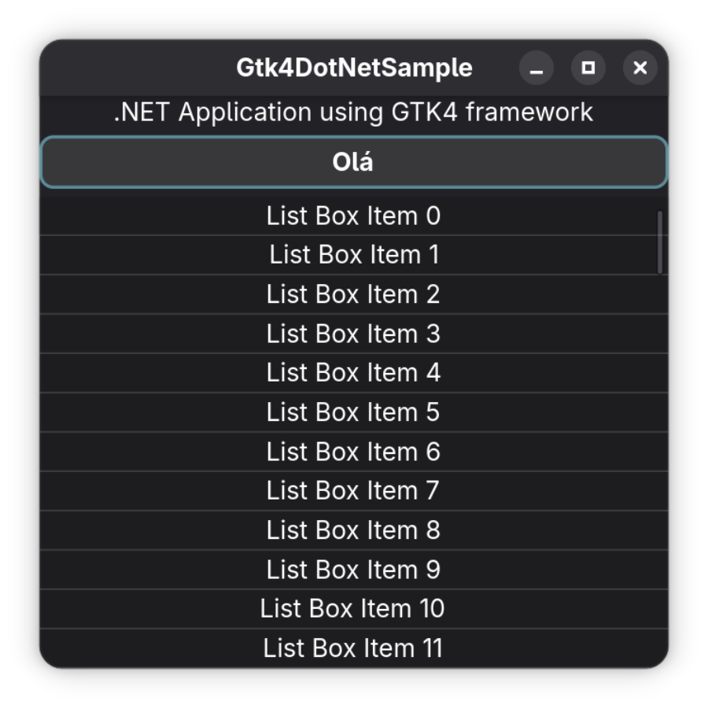

# GTK4 .NET Sample

A sample application demonstrating GTK4 integration with .NET, built and packaged as a Flatpak for Linux distribution.

## Overview

This project showcases how to create a GTK4 graphical user interface using .NET and C#. The application is designed as a learning example and does **not follow any specific architectural/design pattern** - it serves as a straightforward demonstration of GTK4 and .NET interoperability.



## Requirements

- **.NET 10.0** (or later)
- **Flatpak** (for building and distributing the application)
- **GNOME SDK 49** and **GNOME Platform 49** (for Flatpak builds)
- **Linux** (tested on Ubuntu 24.04 LTS)

## Building

### Building with .NET CLI

```bash
dotnet build Gtk4DotNetSample.sln
```

### Publishing a Release Build

```bash
dotnet publish ui/Gtk4DotNetSample.csproj -c Release -r linux-x64 --self-contained -p:UseAppHost=true
```

### Building as Flatpak

The project uses Flatpak for containerized builds and distribution on Linux:

```bash
flatpak-builder --force-clean --user --install-deps-from=flathub --repo=repo builddir --disable-rofiles-fuse com.antevere.Gtk4DotNetSample.yml
```

### Creating a Flatpak Bundle

```bash
flatpak build-bundle repo dist/com.antevere.Gtk4DotNetSample.flatpak com.antevere.Gtk4DotNetSample
```

## Project Structure

- **ui/** - Main GTK4 application source code and UI definition
  - `Program.cs` - Application entry point
  - `Gtk4DotNetSample.csproj` - Project file
  - `main.ui` - GTK UI definition (Cambalache format)
  - `theme.css` - Custom CSS styling
  
- **packaging/** - Distribution and packaging files
  - `com.antevere.Gtk4DotNetSample.desktop` - Desktop entry file
  - `icons/` - Application icons
  
- **com.antevere.Gtk4DotNetSample.yml** - Flatpak manifest configuration
- **Gtk4DotNetSample.sln** - Solution file

## Running

### Run in Development Mode

```bash
dotnet watch run --project Gtk4DotNetSample.sln
```

### Run from Published Build

```bash
./ui/bin/Release/net10.0/linux-x64/publish/Gtk4DotNetSample
```

### Run from Flatpak

```bash
flatpak run com.antevere.Gtk4DotNetSample
```

## Notes

- This is a sample/demonstration project and does not implement any specific architectural patterns
- The application uses GTK4 for UI and .NET for backend logic
- Flatpak provides a sandboxed, portable distribution method for Linux
- The UI is defined using the Cambalache UI builder format

## License

See LICENSE file for details.